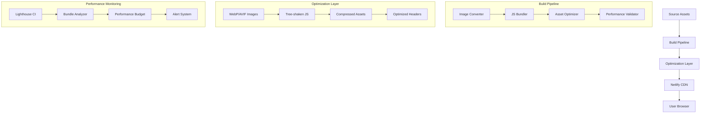

# Design Document

## Overview

This design implements a comprehensive solution to address the critical performance bottlenecks identified in Lighthouse audits, targeting a 90+ performance score. The solution focuses on automated image optimization (18.27s savings), JavaScript bundle optimization (6.59s savings), and network efficiency improvements. The design is structured in 4 phases that can be implemented incrementally while maintaining Netlify compatibility.

## Architecture

### High-Level Architecture



### Critical Performance Bottlenecks Analysis

Based on the Lighthouse report, the priority order for fixes:

1. **Image Optimization (18.27s savings)** - Highest impact
2. **Unused JavaScript (3.55s savings)** - High impact  
3. **Duplicate Modules (3.04s savings)** - High impact
4. **Image Sizing (4.5s savings)** - Medium impact
5. **Network Payload (11.7MB total)** - Medium impact

## Components and Interfaces

### 1. Automated Image Optimization Pipeline

**Purpose:** Convert images to modern formats and optimize sizing automatically

```javascript
// Image Optimization Configuration
const imageOptimization = {
  formats: {
    webp: { quality: 85, effort: 4 },
    avif: { quality: 80, effort: 4 },
    fallback: { quality: 90 }
  },
  sizes: {
    hero: [320, 640, 960, 1280, 1920],
    card: [280, 400, 600],
    thumbnail: [150, 200, 300],
    icon: [32, 64, 128]
  },
  optimization: {
    maxWidth: 1920,
    maxHeight: 1080,
    compressionLevel: 8
  }
};
```

**Key Design Decisions:**
- Use Sharp.js for high-performance image processing
- Generate multiple formats (WebP, AVIF, fallback) automatically
- Create responsive image sets with appropriate breakpoints
- Implement build-time optimization to avoid runtime overhead
- Maintain original images as fallbacks for compatibility

### 2. JavaScript Bundle Optimization System

**Purpose:** Eliminate unused code and deduplicate modules to reduce bundle size

```javascript
// Bundle Optimization Configuration
const bundleOptimization = {
  treeShaking: {
    enabled: true,
    sideEffects: false,
    usedExports: true
  },
  splitting: {
    vendor: ['firebase', 'supabase'],
    common: ['utils', 'config'],
    async: ['games', 'community']
  },
  analysis: {
    unusedThreshold: 0.1, // Remove if <10% used
    duplicateThreshold: 2, // Dedupe if >2 instances
    bundleSizeLimit: '500kb'
  }
};
```

**Optimization Strategy:**
- Use Webpack Bundle Analyzer to identify unused code
- Implement dynamic imports for non-critical features
- Deduplicate Firebase modules across different versions
- Split vendor libraries into separate chunks
- Use ES modules for better tree-shaking

### 3. Critical Resource Loading Strategy

**Purpose:** Optimize LCP and reduce render-blocking resources

```html
<!-- Critical Resource Loading Order -->
<head>
  <!-- 1. Critical CSS (inlined) -->
  <style>/* Critical above-fold styles */</style>
  
  <!-- 2. Preload LCP image -->
  <link rel="preload" as="image" href="/optimized/hero-image.webp">
  
  <!-- 3. Preconnect to critical origins -->
  <link rel="preconnect" href="https://fonts.gstatic.com">
  
  <!-- 4. Non-critical CSS (async) -->
  <link rel="preload" as="style" href="styles.css" onload="this.rel='stylesheet'">
  
  <!-- 5. Critical JS (defer) -->
  <script src="critical.js" defer></script>
</head>
```

**Loading Strategy:**
- Inline critical CSS for above-fold content
- Preload LCP image in WebP format with fallback
- Use resource hints for third-party connections
- Defer non-critical JavaScript
- Implement progressive enhancement

### 4. Build-Time Asset Processing

**Purpose:** Automate optimization during build process

```javascript
// Build Process Configuration
const buildProcess = {
  stages: [
    'analyze-assets',
    'optimize-images', 
    'bundle-javascript',
    'compress-assets',
    'validate-performance'
  ],
  tools: {
    imageOptimizer: 'sharp',
    bundler: 'webpack',
    compressor: 'gzip + brotli',
    validator: 'lighthouse-ci'
  },
  thresholds: {
    imageReduction: 0.6, // 60% size reduction target
    jsReduction: 0.3,    // 30% JS size reduction target
    performanceScore: 90  // Minimum Lighthouse score
  }
};
```

## Data Models

### Image Optimization Model

```typescript
interface OptimizedImage {
  original: {
    path: string;
    size: number;
    dimensions: { width: number; height: number };
  };
  optimized: {
    webp: { path: string; size: number; quality: number };
    avif: { path: string; size: number; quality: number };
    fallback: { path: string; size: number; quality: number };
  };
  responsive: {
    sizes: string;
    srcset: string;
  };
  savings: {
    bytes: number;
    percentage: number;
  };
}
```

### Bundle Analysis Model

```typescript
interface BundleAnalysis {
  modules: {
    name: string;
    size: number;
    used: boolean;
    duplicates: number;
    impact: 'high' | 'medium' | 'low';
  }[];
  chunks: {
    name: string;
    size: number;
    modules: string[];
    loadPriority: 'critical' | 'important' | 'lazy';
  }[];
  recommendations: {
    remove: string[];
    deduplicate: string[];
    split: string[];
  };
}
```

## Error Handling

### Image Optimization Fallbacks

1. **Format Support Detection**
   ```javascript
   const imageSupport = {
     webp: await checkWebPSupport(),
     avif: await checkAVIFSupport()
   };
   
   function selectOptimalFormat(image) {
     if (imageSupport.avif && image.avif) return image.avif;
     if (imageSupport.webp && image.webp) return image.webp;
     return image.fallback;
   }
   ```

2. **Build Failure Recovery**
   ```javascript
   try {
     await optimizeImages();
   } catch (error) {
     console.warn('Image optimization failed, using originals:', error);
     await copyOriginalImages();
   }
   ```

### Bundle Optimization Error Handling

1. **Tree-Shaking Safety**
   ```javascript
   const safeModules = ['polyfills', 'critical-path'];
   
   function isModuleSafeToRemove(module) {
     return !safeModules.includes(module.name) && 
            module.usagePercentage < 0.1;
   }
   ```

2. **Chunk Loading Fallbacks**
   ```javascript
   async function loadChunk(chunkName) {
     try {
       return await import(`./chunks/${chunkName}.js`);
     } catch (error) {
       console.warn(`Failed to load ${chunkName}, loading fallback`);
       return await import('./fallback.js');
     }
   }
   ```

## Testing Strategy

### Performance Testing

1. **Lighthouse CI Integration**
   ```yaml
   # .github/workflows/performance.yml
   - name: Run Lighthouse CI
     uses: treosh/lighthouse-ci-action@v9
     with:
       configPath: './lighthouserc.json'
       budgetPath: './lighthouse-budget.json'
   ```

2. **Bundle Size Monitoring**
   ```javascript
   // Test bundle size limits
   const bundleSizes = await analyzeBundles();
   expect(bundleSizes.main).toBeLessThan(500 * 1024); // 500KB
   expect(bundleSizes.vendor).toBeLessThan(300 * 1024); // 300KB
   ```

### Image Optimization Testing

1. **Format Generation Validation**
   ```javascript
   test('should generate all required image formats', async () => {
     const result = await optimizeImage('test-image.png');
     expect(result.webp).toBeDefined();
     expect(result.avif).toBeDefined();
     expect(result.fallback).toBeDefined();
   });
   ```

2. **Size Reduction Validation**
   ```javascript
   test('should achieve target size reduction', async () => {
     const original = await getFileSize('original.png');
     const optimized = await getFileSize('optimized.webp');
     const reduction = (original - optimized) / original;
     expect(reduction).toBeGreaterThan(0.6); // 60% reduction
   });
   ```

## Implementation Phases

### Phase 1: Image Optimization Infrastructure (Days 1-2)
- **Risk:** Low - Isolated image processing
- **Impact:** High - 18.27s potential savings
- **Deliverables:**
  - Sharp.js integration for image processing
  - WebP/AVIF conversion pipeline
  - Responsive image generation
  - Build script integration

### Phase 2: JavaScript Bundle Optimization (Days 3-4)
- **Risk:** Medium - Could break functionality
- **Impact:** High - 6.59s potential savings  
- **Deliverables:**
  - Webpack bundle analyzer integration
  - Tree-shaking configuration
  - Module deduplication
  - Code splitting implementation

### Phase 3: Critical Resource Optimization (Days 5-6)
- **Risk:** Low - Progressive enhancement
- **Impact:** Medium - LCP improvements
- **Deliverables:**
  - Critical CSS extraction
  - Resource loading optimization
  - Preload strategy implementation
  - Font loading optimization

### Phase 4: Monitoring and Validation (Days 7-8)
- **Risk:** Low - Monitoring only
- **Impact:** Medium - Prevents regressions
- **Deliverables:**
  - Lighthouse CI setup
  - Performance budget enforcement
  - Bundle size monitoring
  - Automated alerts

## Netlify-Specific Implementation

### Build Configuration

```toml
# netlify.toml - Enhanced for critical performance
[build]
  command = "npm run build:optimized"
  publish = "dist"

[build.processing]
  skip_processing = false

[build.processing.images]
  compress = true

[build.processing.css]
  bundle = true
  minify = true

[build.processing.js]
  bundle = false  # We'll handle bundling ourselves
  minify = true

# Performance-optimized headers
[[headers]]
  for = "/assets/images/*"
  [headers.values]
    Cache-Control = "public, max-age=31536000, immutable"
    Vary = "Accept"

[[headers]]
  for = "*.webp"
  [headers.values]
    Content-Type = "image/webp"
    Cache-Control = "public, max-age=31536000, immutable"

[[headers]]
  for = "*.avif"  
  [headers.values]
    Content-Type = "image/avif"
    Cache-Control = "public, max-age=31536000, immutable"
```

### Build Scripts

```json
{
  "scripts": {
    "build:optimized": "npm run optimize:images && npm run optimize:js && npm run build",
    "optimize:images": "node scripts/optimize-images.js",
    "optimize:js": "webpack --config webpack.optimization.js",
    "analyze:bundle": "webpack-bundle-analyzer dist/stats.json",
    "test:performance": "lighthouse-ci autorun"
  }
}
```

## Success Metrics

### Primary Performance Targets
- **Lighthouse Performance Score:** 90+ (currently 31)
- **First Contentful Paint:** ≤1.5s (target from requirements)
- **Largest Contentful Paint:** ≤2.5s (target from requirements)
- **Cumulative Layout Shift:** <0.1 (target from requirements)
- **Total Blocking Time:** <300ms (target from requirements)

### Optimization Targets
- **Image Size Reduction:** 60-80% (18.27s savings target)
- **JavaScript Size Reduction:** 30-50% (6.59s savings target)
- **Network Payload Reduction:** <5MB total (currently 11.7MB)
- **HTTP Requests:** <100 total requests
- **Bundle Size:** Main bundle <500KB, Vendor bundle <300KB

### Business Impact Metrics
- **Page Load Time:** <3s on 3G networks
- **Time to Interactive:** <5s on mobile devices
- **Bounce Rate Reduction:** Target 20% improvement
- **Core Web Vitals:** Pass all thresholds for SEO benefits

## Rollback Strategy

### Automated Rollback Triggers
- Performance score drops below 80
- Bundle size increases by >20%
- Critical functionality breaks
- Build time exceeds 10 minutes

### Rollback Procedures
1. **Image Optimization Rollback:** Restore original images from backup
2. **Bundle Optimization Rollback:** Revert to previous webpack config
3. **Critical Resource Rollback:** Remove preload hints and inline CSS
4. **Full System Rollback:** Git revert to last known good commit

Each phase includes feature flags to enable/disable optimizations independently.