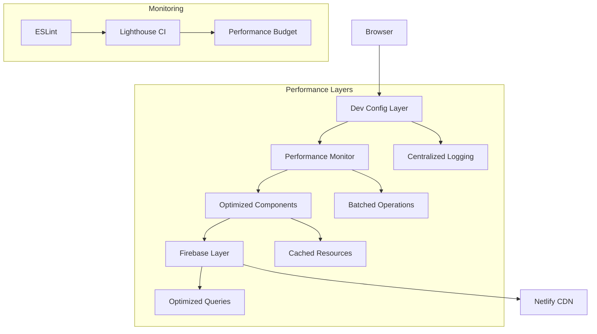

# Design Document

## Overview

This design implements a comprehensive performance optimization system for GlitchRealm that addresses loading state issues, reduces page jank, and improves Core Web Vitals. The solution is structured in 6 phases (PR A-F) that can be implemented incrementally while maintaining backward compatibility and Netlify hosting compatibility.

## Architecture

### High-Level Architecture



### Loading State Fix Strategy

The loading state issue (showing only logo instead of full content) will be addressed through:

1. **Initialization Order Control** - Centralized config ensures proper loading sequence
2. **Resource Preloading** - Critical assets load first to prevent partial renders
3. **Batched Operations** - Prevent render blocking during heavy operations
4. **Firebase Optimization** - Faster auth state resolution

## Components and Interfaces

### 1. Dev Config Layer (PR A)

**Purpose:** Centralize developer configuration and provide production-safe logging

```javascript
// dev-config.js - Core Interface
export interface DevConfig {
  DEV_UIDS: Set<string>;
  isDev(): boolean;
  logger: {
    log(...args: any[]): void;
    warn(...args: any[]): void;
    error(...args: any[]): void;
    group(...args: any[]): void;
    groupEnd(): void;
  };
}
```

**Key Design Decisions:**
- Uses Set for O(1) UID lookups
- Logger methods no-op in production except errors
- Fallback mechanisms for missing Firebase auth
- Single source of truth for developer detection

### 2. Performance Monitor (PR B)

**Purpose:** Optimize performance-optimization.js to reduce blocking operations

```javascript
// Enhanced Performance API
window.GlitchRealmPerf = {
  config: {
    autoInit: boolean;
    rootMargin: string;
    batchSize: number;
  };
  reinit(): void;
  report(): PerformanceReport;
  observeImage(img: HTMLImageElement): void;
  getConnectionQuality(): string;
  supportsWebP(): boolean;
}
```

**Optimization Strategy:**
- Defer expensive `naturalWidth` checks to `requestIdleCallback`
- Batch MutationObserver callbacks using `requestAnimationFrame`
- Use `document.images` instead of `querySelectorAll`
- Add config flag to disable auto-init for testing

### 3. Content Optimization Layer (PR C)

**Purpose:** Hoist expensive operations and cache frequently used resources

```javascript
// Hoisted Utilities Interface
const MODERATION_PATTERNS: {
  offensive: RegExp;
  spam: RegExp;
  [key: string]: RegExp;
};

const TEXT_NORMALIZER: {
  normalize(text: string): string;
  createVariations(text: string): string[];
};

const DOM_REFS: {
  postsList: HTMLElement | null;
  emptyEl: HTMLElement | null;
  loadMoreBtn: HTMLElement | null;
  init(): void;
};
```

**Caching Strategy:**
- LRU cache for text normalization (max 500 entries)
- Pre-compiled regex patterns at module scope
- Long-lived DOM reference cache
- Batch HTML sanitization operations

### 4. Image Optimization System (PR D)

**Purpose:** Prevent layout shifts and optimize image loading

```css
/* Critical CSS for Layout Stability */
.game-card img {
  aspect-ratio: 16 / 9;
  width: 100%;
  height: auto;
  object-fit: cover;
}

.loading-placeholder {
  background: linear-gradient(90deg, #f0f0f0 25%, #e0e0e0 50%, #f0f0f0 75%);
  background-size: 200% 100%;
  animation: loading 1.5s infinite;
}
```

**Image Loading Strategy:**
- Add `width` and `height` attributes to prevent CLS
- Preload critical images in document head (max 3)
- Use `loading="lazy"` and `decoding="async"` for non-critical images
- Implement responsive images with `srcset` where applicable

### 5. Firebase Optimization Layer (PR E)

**Purpose:** Reduce Firestore queries and optimize auth state management

```javascript
// Optimized Verified Cache Interface
const verifiedCache = {
  cache: Map<string, boolean>;
  pending: Map<string, Promise<boolean>>;
  
  async get(uid: string): Promise<boolean>;
  async batchGet(uids: string[]): Promise<void>;
  _fetchBatch(uids: string[]): Promise<void>;
};
```

**Query Optimization Strategy:**
- Batch up to 10 UIDs per Firestore query
- Deduplicate concurrent requests using pending map
- Early returns for no-op scenarios in playtime sync
- Cache verified status with TTL

### 6. CI/CD Monitoring System (PR F)

**Purpose:** Automated performance monitoring and code quality

```yaml
# Performance Budget Configuration
performance_budget:
  FCP: 1500ms
  LCP: 2500ms
  CLS: 0.1
  bundle_size_increase: 5%
```

## Data Models

### Performance Metrics Model

```typescript
interface PerformanceReport {
  timestamp: number;
  metrics: {
    fcp: number;
    lcp: number;
    cls: number;
    frameDrops: number;
  };
  resources: {
    largeImages: number;
    unoptimizedImages: number;
    totalRequests: number;
  };
  errors: string[];
}
```

### Cache Models

```typescript
interface TextCache {
  normalized: Map<string, string>;
  variations: Map<string, string[]>;
  maxSize: number;
}

interface VerifiedCache {
  cache: Map<string, boolean>;
  pending: Map<string, Promise<boolean>>;
  ttl: number;
}
```

## Error Handling

### Loading State Error Prevention

1. **Initialization Timeout Protection**
   ```javascript
   const initTimeout = setTimeout(() => {
     console.error('Initialization timeout - forcing fallback render');
     renderFallbackContent();
   }, 5000);
   ```

2. **Resource Loading Fallbacks**
   ```javascript
   const criticalResources = ['auth', 'config', 'styles'];
   const loadedResources = new Set();
   
   function checkCriticalResources() {
     if (loadedResources.size === criticalResources.length) {
       clearTimeout(initTimeout);
       renderFullContent();
     }
   }
   ```

3. **Firebase Auth State Recovery**
   ```javascript
   firebase.auth().onAuthStateChanged((user) => {
     loadedResources.add('auth');
     checkCriticalResources();
   }, (error) => {
     console.error('Auth error:', error);
     renderFallbackContent();
   });
   ```

### Performance Error Handling

1. **Graceful Degradation for Performance Features**
   - If `requestIdleCallback` unavailable, use `setTimeout`
   - If `IntersectionObserver` unavailable, disable lazy loading
   - If WebP unsupported, fallback to original formats

2. **Monitoring Error Recovery**
   ```javascript
   try {
     performanceOptimization.init();
   } catch (error) {
     logger.error('Performance optimization failed:', error);
     // Continue without optimizations
   }
   ```

## Testing Strategy

### Unit Testing

1. **Dev Config Tests**
   - Test `isDev()` with various auth states
   - Verify logger no-ops in production
   - Test fallback mechanisms

2. **Performance Monitor Tests**
   - Mock `requestIdleCallback` and verify batching
   - Test MutationObserver batching behavior
   - Verify config flag functionality

3. **Cache Tests**
   - Test LRU cache eviction
   - Verify regex pattern compilation
   - Test DOM reference caching

### Integration Testing

1. **Loading State Tests**
   ```javascript
   // Test full loading sequence
   it('should render full content without hard refresh', async () => {
     await loadPage();
     expect(screen.getByText('InfinityByte')).toBeVisible();
     expect(screen.getByText('infinitybyte.dev@gmail.com')).toBeVisible();
     expect(screen.getByText('GITHUB')).toBeVisible();
   });
   ```

2. **Performance Tests**
   ```javascript
   // Test Core Web Vitals
   it('should meet performance budgets', async () => {
     const metrics = await measurePerformance();
     expect(metrics.fcp).toBeLessThan(1500);
     expect(metrics.lcp).toBeLessThan(2500);
     expect(metrics.cls).toBeLessThan(0.1);
   });
   ```

### End-to-End Testing

1. **Lighthouse CI Integration**
   - Automated performance audits on PR
   - Performance budget enforcement
   - Visual regression detection

2. **Cross-Browser Testing**
   - Test on Chrome, Firefox, Safari
   - Mobile device testing
   - 3G network simulation

## Netlify-Specific Considerations

### Build Optimization

1. **Asset Optimization**
   ```toml
   # netlify.toml
   [build.processing.images]
     compress = true
   
   [build.processing.css]
     bundle = true
     minify = true
   ```

2. **Headers Configuration**
   ```
   # _headers
   /assets/*
     Cache-Control: public, max-age=31536000, immutable
   
   /*.js
     Cache-Control: public, max-age=86400
   ```

3. **Redirects for SPA**
   ```
   # _redirects
   /*    /index.html   200
   ```

### Performance Monitoring Integration

1. **Build Performance Tracking**
   - Monitor build times in Netlify
   - Track bundle size changes
   - Alert on performance budget violations

2. **Runtime Performance**
   - Use Netlify Analytics for Core Web Vitals
   - Monitor error rates and loading issues
   - Track user experience metrics

## Implementation Phases

### Phase 1: Critical Infrastructure (PR A-B)
- **Risk:** Low - Foundational changes
- **Impact:** High - Fixes loading state issues
- **Timeline:** 1-2 days

### Phase 2: Content Optimization (PR C-D)  
- **Risk:** Low - Performance improvements
- **Impact:** Medium - Reduces jank and CLS
- **Timeline:** 2-3 days

### Phase 3: Firebase & Monitoring (PR E-F)
- **Risk:** Low - Query optimization
- **Impact:** Medium - Reduces database load
- **Timeline:** 1-2 days

## Rollback Strategy

Each PR includes specific rollback steps:

1. **File-level rollbacks** - Revert specific files
2. **Configuration rollbacks** - Remove new config files
3. **Dependency rollbacks** - Remove added packages
4. **Feature flags** - Disable optimizations via config

## Success Metrics

### Primary Metrics
- FCP <= 1.5s (currently unknown)
- LCP <= 2.5s (currently unknown)  
- CLS < 0.1 (currently unknown)
- Loading state issues eliminated (100% success rate)

### Secondary Metrics
- Bundle size increase <= 5%
- Firestore query reduction >= 30%
- Frame drops during gameplay < 5%
- Build time impact <= 10%